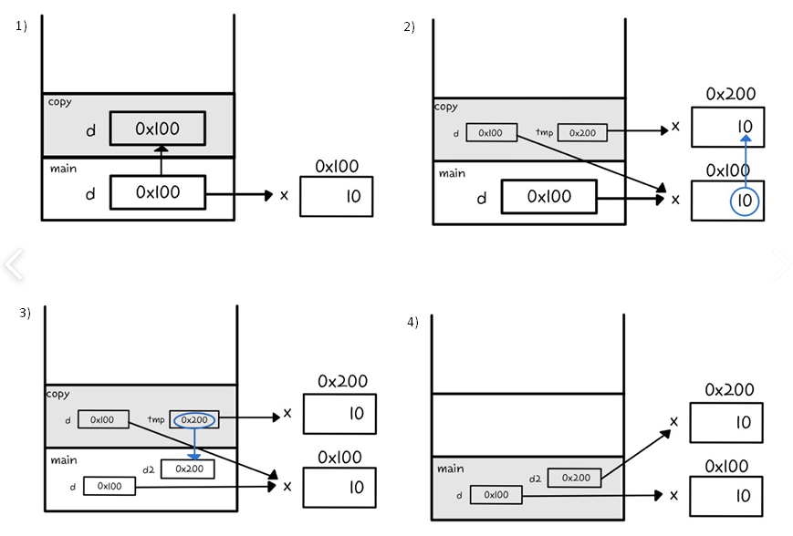

매개변수의 타입이 **기본형**일 때는 **값이 복사**되어서 변수의 **값을 읽는 것만 가능**하다.
**참조형**일 때는 **인스턴스의 주소가 복사**되어서 **변수의 값을 읽고 변경**할 수 있다.

## 기본형 매개변수

```java
class Data { int x; }

class PrimitiveParamEx {
	public static void main(String[] args) {
		Data d = new Data();
		d.x = 10;
		System.out.println("main() : x = " + d.x);

		change(d.x);
		System.out.println("After change(d.x)");
		System.out.println("main() : x = " + d.x);
	}

	static void change(int x) {
		x = 1000;
		System.out.println("change() : x = " + x);
	}
}
```

- 호출한 메소드에 기본형 매개변수가 선언되어 있는 경우 **인자(d.x)의 값을 복사**하여 넘겨준 것
- 호출한 메소드에서 값을 1000으로 변경하더라도 호출한 메소드의 매개변수 값만 변경 될 뿐, 인자로 넘겨준 변수는 영향을 받지 않는다.
  

## 참조형 매개변수

```java
class Data { int x; }

class ReferenceParamEx {
	public static void main(String[] args) {

		Data d = new Data();
		d.x = 10;
		System.out.println("main() : x = " + d.x);

		change(d);
		System.out.println("After change(d)");
		System.out.println("main() : x = " + d.x);

	}

	static void change(Data d) {
		d.x = 1000;
		System.out.println("change() : x = " + d.x);
	}
}
```

- 호출된 메소드에 참조형 매개변수가 선언되어 있는 경우 **값이 저장된 주소**를 호출된 메소드에 넘겨준다.
- 호출된 메소드의 매개변수가 넘겨받은 인자와 같은 주소값을 가리키고 있기 때문에 호출된 메소드에서 값을 변경하게되면 그 주소값을 가지고 있는 변수의 값이 변경된다.
  

## 참조형 반환타입

```java
class Data { int x; }

class ReferenceReturnEx {
	public static void main(String[] args)
	{
		Data d = new Data();
		d.x = 10;

		Data d2 = copy(d); //1
		System.out.println("d.x ="+d.x);
		System.out.println("d2.x="+d2.x);
	}

    //새로운 객체를 생성한 다음, 매개변수로 넘겨받은 객체에 저장되어 있는 값을 복사해서 반환하는 메소드
    static Data copy(Data d) {
        Data tmp = new Data();
        tmp.x = d.x; //2

        return tmp; //3
    }
}
```

- copy메소드에서 생성한 객체를 main메소드에서 사용하려면 copy메소드 내에서 생성한 객체의 주소를 반환해주어야 한다. 그렇지 않으면 copy메소드가 종료되면서 생성한 객체의 참조가 사라지기 때문이다.
- 반환타입이 참조형이라는 것은 메소드가 **객체의 주소**를 반환한다는 것을 의미한다.
  

1. copy메소드를 호출하면서 참조변수의 d의 값이 매개변수 d에 복사된다.
2. 새로운 객체를 생성한 다음, d.x에 저장된 값을 tmp.x에 복사한다.
3. copy메소드가 종료되면서 반환 된 tmp의 값은 main메소드의 d2에 저장된다.
4. d2로 새로운 객체를 다룰 수 있다.

```toc

```
