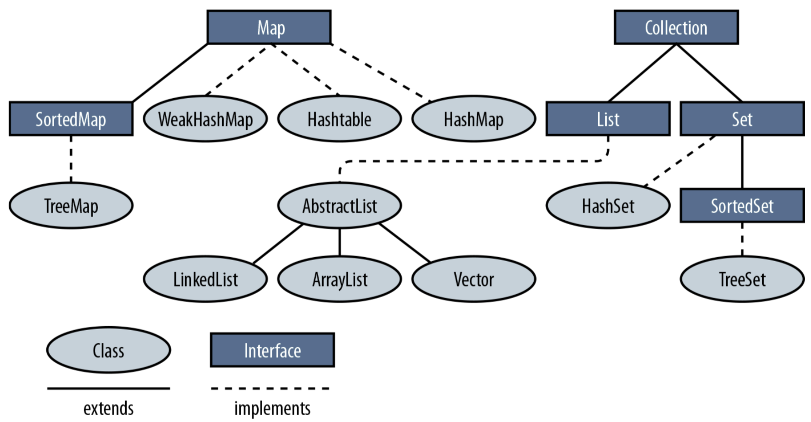

## 개요
컬렉션 프레임워크는 **다수의 데이터를 저장하는 클래스들을 표준화한 설계**이다. 
 
JDK 1.2 이전까지는 다수의 데이터를 다루기 위해서 Vector, Hashtable, Propeties와 같은 클래스를 제공했지만, 서로 각자 다른 방식으로 처리해야 했다. JDK 1.2 부터는 컬렉션 프레임워크가 등장하면서 모든 컬렉션 클래스를 표준화된 방식으로 다룰 수 있게되었다.
 
 

## 구성요소

[이미지 출처](https://dinfree.com/lecture/language/112_java_6.html)

컬렉션 프레임워크에서는 List, Set, Map 3가지 타입의 인터페이스를 정의하였다. 그리고 공통된 부분을 다시 추출하여 Collection 인터페이스로 정의하였다. Map은 다른 두 인터페이스와 다른 형태(key, value)로 데이터를 다루기 때문에 Collection 인터페이스에 포함되지 못하였다.

|인터페이스|특징|구현 클래스|
|-|-|-|
|List|순서가 있으며 데이터의 중복을 허용한다.|ArrayList, LinkedList, Vector 등|
|Set|순서가 없으며 데이터의 중복을 허용하지 않는다.|HashSet, TreeSet 등|
|Map|키와 값의 쌍으로 이루어져 있으며 순서가 유지되지 않는다.  키는 중복을 허용하지 않고, 값은 중복을 허용한다.|HashMap, HashTable 등|
