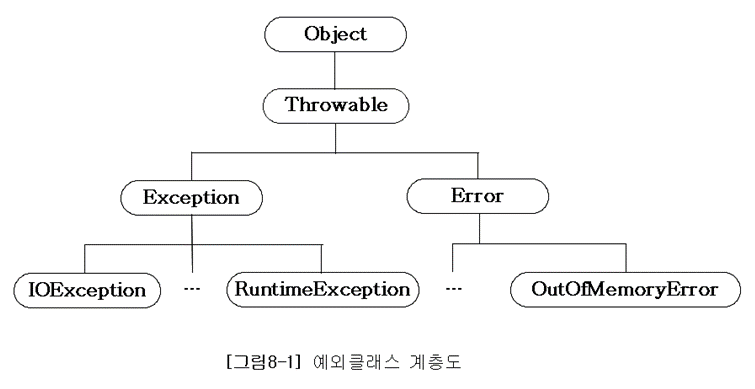

# 개요

자바는 실행 시 발생할 수 있는 프로그램의 오류(런타임 에러)를 에러와 예외 두가지로 구분하였다.

1. 에러 : 프로그램 코드에 의해서 수습될 수 없는 심각한 오류
2. 예외 : 프로그램 코드에 의해서 수습될 수 있는 오류

에러는 프로그램이 비정상적으로 종료되는걸로 끝나지만, 예외는 적절한 코드를 미리 작성해놓음으로써 프로그램의 비정상적인 종료를 막을 수있다.

# 예외 클래스의 계층구조

Exception 클래스는 체크 예외(checked exception)과 언체크 예외(unchecked exception) 으로 구분된다.

## 체크예외(Checked Exception)

- Exception 클래스의 하위 클래스 중 **RuntimeException 클래스를 상속받지 않는 클래스**
- 체크예외가 발생할 수 있는 메소드를 사용할 경우 반드시 예외를 처리하는 코드를 같이 작성해야 한다.
- 예외처리를 해주지 않는다면 컴파일 에러가 발생한다.
- 위처럼 체크예외가 예외를 강제하기 때문에 예외를 누락시키지 않는다는 장점도 있지만, 무분별한 throws 남발과 같은 단점도 있다.

## 언체크예외(Unchecked Exception)

- **RuntimeException 클래스를 상속받는 클래스**
- 언체크예외는 개발자가 예상가능하며, 코드에서 미리 조건을 체크한다면 피할 수 있기때문에 예외처리를 강제하지 않는다.

# 예외처리 방법

## 예외복구

예외상황을 파악하고 문제를 해결해서 정상 상태로 돌려놓는 것이다. 예외로 인해 기본 작업 흐름이 불가능하다면 다른 작업 흐름으로 유도해주는 것이다. 예외가 처리 되었으면 사용자에게 예외상황으로 비춰지더라도 애플리케이션에서는 정상적으로 설계된 흐름을 따라 진행되어야 한다.

## 예외처리 회피

예외처리를 자신이 담당하지 않고 자신을 호출한 쪽으로 던져버리는 것이다. 자신을 사용하는 쪽에서 예외를 다루는게 최선의 방법이라고 느껴질 때 사용된다. 

## 예외전환

예외회피와 비슷하지만, 발생한 예외를 그대로 넘기는게 아니라 적절한 예외로 전환하여 던진다.

예외전환은 주로 두가지 목적으로 사용된다.

1. 예외의 의미를 분명하게 해주기 위해서
    
    > 예를 들어 새로운 사용자를 등록하려고 시도했을 때, 아이디가 같은 사용자가 있어서 오류가 발생한다면 JDBC API는 SQLException을 발생시킨다. 하지만 서비스계층에서는 이 오류가 발생한 명확한 이유를 알수가 없다. 아이디 중복과 같은 상황은 복구 가능한 예외상황이므로 SQLException의 정보를 해석해서 DuplicateUserIdException과 같은 명확한 예외로 던져준다면 서비스 계층에서는 적절한 복구 작업을 시도할 수 있을 것이다.
    > 
2. 체크예외를 언체크예외로 포장할 때
    
    > 일반적으로 체크예외를 계속해서 넘기는 건 무의미하다. 예외처리가 강제되기 때문에 명시적으로 예외를 처리하다가 관련없는 메소드까지 전달되게 되는 것이 의미가 있을까? 어차피 복구가 불가능한 예외라면 불필요하게 체크할 필요가 없다. 가능한 빨리 언체크예외로 포장하여 다른 메소드 작성시 불필요한 예외처리가 들어가지 않도록 해주는 것이 좋다.
    > 

[이미지출처](https://github.com/castello/javajungsuk3/blob/master/ppt/%5BJava%EC%9D%98%EC%A0%95%EC%84%9D%5Dch8_%EC%98%88%EC%99%B8%EC%B2%98%EB%A6%AC.ppt) [출처1](https://product.kyobobook.co.kr/detail/S000000935360) [출처2](https://product.kyobobook.co.kr/detail/S000001550352)