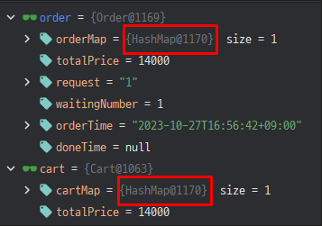
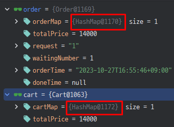

[수정목록](https://github.com/hwana/kiosk/commit/e75261f61c1e455ae450205d61c3637c9200b606)

### 1. Cart 클래스 신규 생성

- 현재상황 : 주문 상태를 필드가 아닌 리스트로 관리하기로 팀원들과 협의 → 주문 상태 필드 삭제 및 대기/완료리스트 신규 생성
- 문제점 : 대기리스트에 주문을 담으려고 하니까 값이 초기화되는 문제 발생
- 원인 : Order 클래스가 장바구니의 역할까지 하고 있는 것
- 해결방안 : Cart 클래스를 추가하여 Order 클래스의 역할 부담을 덜어줌
- 느낀점 : 혼자서 헤메이다가 팀원들과 대화를 나누다보니 해결방안이 딱 나왔다! 하나의 클래스는 하나의 역할을 담당하는 것이 얼마나 중요한건지 한번 더 깨닫게 되었다.

### 2. 관리자 모드 추가

- 대기목록 출력
    - 현재상황 : 주문을 할 때마다 새로운 Order 인스턴스를 생성하여 Cart에 있는 값을 넣어주고 waitingList에 추가해 줌
		```java
		Order order = new Order(cart.getCartMap(), cart.getTotalPrice(), request, waitingNumber, makeISO8601Date());
		waitingList.add(order);
		
		System.out.println("주문이 완료되었습니다.");
		System.out.println("대기번호는 [ " + waitingNumber++ + " ]번 입니다.");
		System.out.println("(3초 후 메뉴판으로 돌아갑니다.)");
		
		//다음 주문을 위한 장바구니 초기화
		resetCart();
		```
    
    - 문제점 : 대기목록을 출력하기위해 waitingList에 있는 Order 인스턴스의 값을 가져옴 → 다른 필드들은 값이 있는데 orderMap만 사라지는 문제 발생
    
		```java
		public void printOrderList(List<Order> orderList) {
			for (int i = 0; i < orderList.size(); i++) {
				System.out.println("[       " + (i + 1) + " 번째 주문      ]");
				System.out.println("1. 대기 번호 : " + orderList.get(i).getWaitingNumber());
				System.out.println("2. 주문 상품 목록");
		
				Map<Product, Integer> orderMap = orderList.get(i).getOrderMap(); // 값이 없음!!!!
		
				for (Product product : orderMap.keySet()) {
					System.out.println("    - 상품명 : " + product.getName());
					System.out.println("    - 가격 : " + product.getPrice());
					System.out.println("    - 개수 : " + orderMap.get(product) + "개");
				}
		
				System.out.println("3. 주문 총 가격 : " + orderList.get(i).getTotalPrice());
				System.out.println("4. 요청 사항 : " + orderList.get(i).getRequest());
				System.out.println("5. 주문 일시 : " + orderList.get(i).getOrderTime());
		
				String doneTime = orderList.get(i).getDoneTime();
		
				if (doneTime != null) {
					System.out.println("6. 완료 주문 일시 : " + doneTime);
				}
			}
		}
		```
    
    - 원인
        
        `Order order = new Order(cart.getCartMap(), cart.getTotalPrice(), request, waitingNumber, makeISO8601Date());`
        
        Order 인스턴스 생성 시 orderMap(첫번째 인자)을 `cart.getCartMap()` 형태로 넘기기 때문에 **주소값**이 Order 인스턴스에 저장되었다.
        
        
        
        디버깅 했을 때, 같은 주소값을 가지고 있는 것을 확인할 수 있다.
        
        그 다음 `resetCart();` 메소드로 cartMap을 clear해주기 때문에 Order 인스턴스에 저장된 값도 함께 초기화되어버린다.
        
    - 해결방안 : 새로운 공간을 할당하여 인자로 넘겨주었다.
        
        `Order order = new Order(new HashMap<>(cart.getCartMap()), cart.getTotalPrice(), request, waitingNumber, makeISO8601Date());`
        
        
        
        서로 다른 주소값을 가지고 있는 것을 확인할 수 있다.
        
    - 느낀점 : 이 부분은 혼자서 디버깅을 해도 찾을 수가 없어서 튜터님과 함께 디버깅을 진행했다. 튜터님은 cartMap과 orderMap의 상관관계에 대해서 물어보고 혹시 map들이 초기화 되는 부분들이 어딘지 물어보셨다. 이런방식으로 접근을 하다보니 resetCart() 메소드가 튜터님 눈에 들어오게 되었고 결국은 cartMap을 얕은 복사로 넘겨주고 있어서 발생한 문제라는 것을 알게되었다. 나 혼자봤으면 오늘 하루종일 봐도 못찾았을 것 같다..! 다시 한번 자바에서 값을 대입하거나, 복사할 때 신경써야한다는 것을 느꼈다.
- 완료목록 출력
    - 대기목록 출력하는 부분과 똑같다. printOrderList() 메소드를 사용하는데 인자로 doneList를 보낸다.
    - 대기목록 출력과 다른점 하나는 주문완료처리일시를 출력하는 것이다. 나는 완료일시에 값이 있으면 출력하고, 값이 없으면 출력하지 않는것으로 했다.
- 대기목록 → 완료목록 이동
    - 인덱스를 활용하여 대기목록에 있는 객체를 완료목록으로 이동시킨 뒤 대기목록에서는 삭제시켰다.