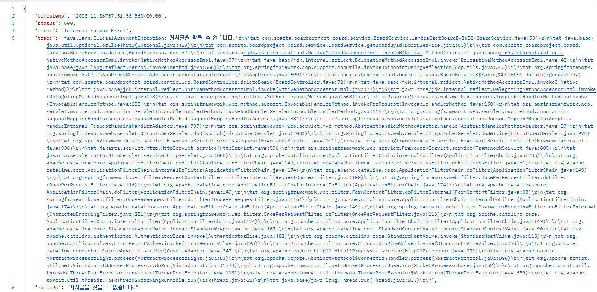
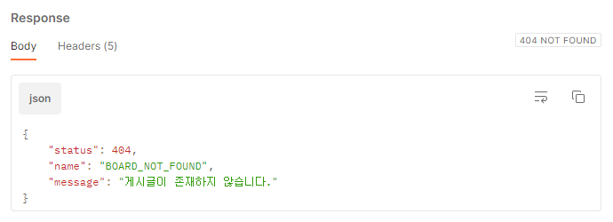

## 📝 오늘의 내용정리

[알고리즘 스터디 6일차](https://github.com/StudySpringAlgorithm/Study_Algorithm_TeamSpring/blob/main/Kim/day6/day6.md)

### ResponseEntity

ResponseEntity는 스프링에서 제공하는 HttpEntity를 상속받아 구현한 클래스이다.

응답을 나타내는 클래스로, 응답 본문, 상태코드, 헤더를 포함하고 있다.

ResponseEntity를 사용하면 응답을 상세하게 제어할 수 있어서 클라이언트와 서버간의 통신을 유연하게 처리할 수 있다.

### Custom Exception

현재 코드에서는 게시글이 존재하지 않을 때와 비밀번호가 일치하지 않을 때 예외상황을 처리하고 있는데, 모두 500으로 클라이언트에게 전달된다. 의미없는 데이터도 같이 전달되는 상황이다.



발생한 예외를 적절하게 전달하기 위해서 커스텀 예외를 만들어 보자!

### 1. ErrorCode enum 생성

```java
@AllArgsConstructor
@Getter
public enum ErrorCode {
	INVALID_AUTH(HttpStatus.UNAUTHORIZED, "비밀번호가 일치하지 않습니다."),
	BOARD_NOT_FOUND(HttpStatus.NOT_FOUND, "게시글이 존재하지 않습니다."),
	;

	private final HttpStatus httpStatus;
	private final String message;

}
```

### 2. Exception, ExceptionHandler 추가

```java
@AllArgsConstructor
@Getter
public class CustomException extends RuntimeException{
	ErrorCode errorCode;
}
```

```java
@ControllerAdvice
public class CustomExceptionHandler {

	@ExceptionHandler(CustomException.class)
	public ResponseEntity<ErrorResponseEntity> handleCustomException(CustomException e){
		return ErrorResponseEntity.toResponseEntity(e.getErrorCode());
	}
}
```

#### @ControllerAdvice

- 여러 컨트롤러에서 발생할 수 있는 예외를 일괄처리 한다.

#### @ExceptionHandler

- @ControllerAdvice가 적용된 클래스 내부에서 특정 예외 타입을 처리하는 메소드를 정의할 수 있다.

### 3. ErrorResponseEntity 추가

```java
@Data
@Builder
public class ErrorResponseEntity {
    private int status;
    private String name;
    private String message;

    public static ResponseEntity<ErrorResponseEntity> toResponseEntity(ErrorCode e){
        return ResponseEntity
                .status(e.getHttpStatus())
                .body(ErrorResponseEntity.builder()
	              		.status(e.getHttpStatus().value())
	                  .name(e.name())
	                  .message(e.getMessage())
	                  .build());
    }
}
```

### 4. 사용

```java
private Board getBoardById(long id) {
	return boardRepository.findById(id).orElseThrow(() -> new CustomException(StatusEnum.BOARD_NOT_FOUND));
}

// 비밀 번호 일치 여부 확인
private void passwordCheck(Board board, String inputPassword) {
	if (!board.getPassword().equals(inputPassword)) {
		throw new CustomException(StatusEnum.PASSWORD_NOT_MATCHED);
	}
}
```

### 5. 깔끔!



## 🔚 오늘의 마무리

스프링 과제를 마무리하고 제출했다. 아직도 Exception을 처리하는건 낯설다. 낯설었던 코드들이 언젠가 익숙해졌던 것처럼 Exception 처리도 하다보면 익숙해지는 날이 오지 않을까? 물론 그런 순간에 도달하려면 더욱더 열심히 해야겠지!


```toc

```