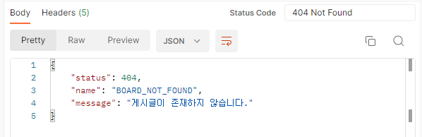
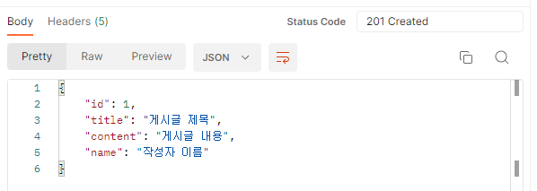

## 📝 오늘의 내용정리

[알고리즘 스터디 7일차](https://github.com/StudySpringAlgorithm/Study_Algorithm_TeamSpring/blob/main/Kim/day7/day7.md)

## 공통 응답 모듈 만들기

### 계기



Exception이 발생했을 때 응답값을 위 이미지처럼 전달해주고 있었다.



게시글 등록/수정/삭제에 성공했을 때는 위 이미지처럼 성공한 데이터들을 전달해주고 있었다.

성공했을때도 Exception이 발생했을 때와 같은 형태로 전달해주고 싶어졌다.

그래서 공통 응답  모듈을 만들기로 결심했다!

### CommonApiResponse.java

```java
@Getter
@Builder
public class CommonApiResponse<T> {
		private HttpStatus status;
		private T data;
		private String message;
	
		public static <T> CommonApiResponse<T> createSuccess(T data, StatusEnum e) {
			return new CommonApiResponse<>(e.getHttpStatus(), data, e.getMessage());
		}
	
		public static CommonApiResponse<?> createWithNoData(StatusEnum e) {
			return new CommonApiResponse<>(e.getHttpStatus(), null, e.getMessage());
		}
}
```

상태코드와 데이터 메시지를 가지고 있는 CommonApiResponse 클래스를 생성하고 컨트롤러에서 사용을 했다.

```java
public ResponseEntity<CommonApiResponse<BoardResponseDto>> addBoard(@RequestBody CreateBoardRequestDto request) {
		Board savedBoard = boardService.save(request);
		return ResponseEntity.status(HttpStatus.CREATED).body(CommonApiResponse.createSuccess(new BoardResponseDto(savedBoard), StatusEnum.CREATED));
		//return ResponseEntity.status(HttpStatus.CREATED).body(new BoardResponseDto(savedBoard)); 
}
```

작성을 하고보니 *굳이 이렇게까지 한번 더 감싸서 값을 전달하는게 맞나..?* 라는 생각이 엄청나게 들었다. 뭔가 이상해서 바로 튜터님을 찾아갔다.

튜터님의 피드백은 

1. 클라이언트와 협의 후 상황에 따라 전달되는 응답값은 언제든지 달라질 수 있다.
2. status는 ResponseEntity를 통해서 전달되고 있으니 한번 더 감싸서 전달되는게 의미가 없다.
3. 메시지는 주로 모호한 상황을 설명하기 위해서 전달하는 값인데, 현재 게시글 등록/수정/삭제의 성공은 200 상태코드를 전달하는 것만으로도 충분한 상황설명이 된다.

## 🔚 오늘의 마무리

### 결론 : 역시 굳이..?라는 생각이 들때는 하지마라

나는 이미 전달되고 있던 상태코드를 한번 더 보내주고 싶어했고, 설명을 하지 않아도 되는 상황을 메시지로 담아서 전달하고 싶었던 것이였다😬

지금 프로젝트에서는 Exception 상황만 커스텀 에러로 응답값을 처리하고, 성공하는 상황은 그대로 두는게 적절하다는 생각이 들었다! 결국 이걸 고민하느라 시간을 많이 소비했지만 의미있는 고민이였다😜

```toc

```