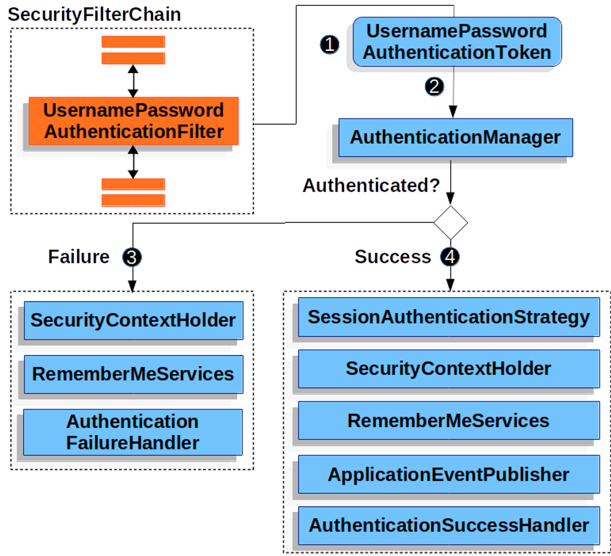
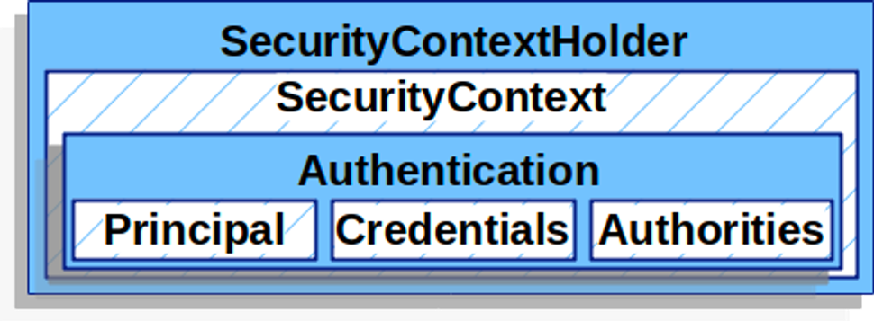
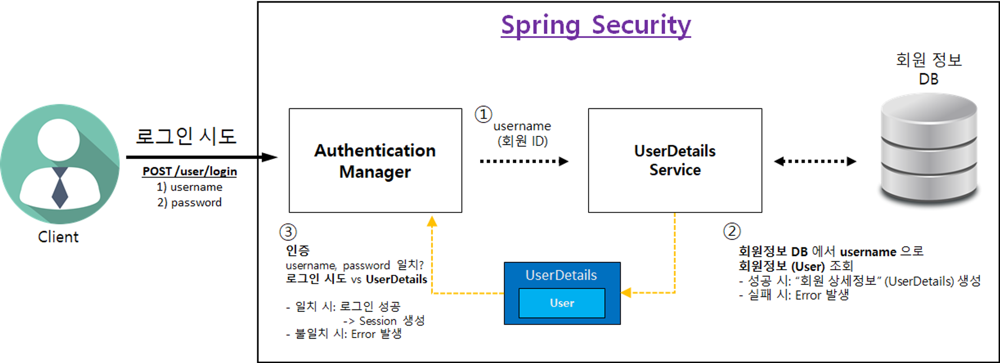

# WebSecurityConfig

```java
@Configuration
@EnableWebSecurity
public class WebSecurityConfig {

	@Bean
	public SecurityFilterChain securityFilterChain(HttpSecurity http) throws Exception {
		// CSRF 설정
		http.csrf((csrf) -> csrf.disable());

		http.authorizeHttpRequests((authorize) -> authorize
            .requestMatchers(PathRequest.toStaticResources().atCommonLocations())
                .permitAll().anyRequest().authenticated());

		http.formLogin(Customizer.withDefaults());

		return http.build(); 
	
}
```

- CSRF(Cross Site Request Forgery)란?
    - 웹 취약점 공격 방법중 하나로 사용자가 자신의 의지와 무관하게 공격자가 의도한 행위를 특정 웹사이트에 요청하게 하는 공격
- Spring Security에서는 CSRF 예방기능을 제공하는데 DISABLE 하는 이유
    
    [Cross Site Request Forgery (CSRF) :: Spring Security](https://docs.spring.io/spring-security/reference/features/exploits/csrf.html#csrf-considerations)
    
    공식 페이지에 나와있듯, CSRF 설정은 브라우저에서 처리할 수 있는 모든 요청에 대해서 사용하는 것이 좋다. CSRF를 사용하지 않도록 사용하는 경우는 브라우저 이외의 클라이언트에서만 사용하는 서비스(REST API)를 생성할 경우이다. REST API는 서버에 인증정보를 보관하지 않기 때문에 CSRF 공격에 크게 영향을 받지 않는다.
    
- authorizeRequests() : 특정 경로에 대한 접근 권한을 지정하는 메소드
- requestMatchers(PathRequest.toStaticResources().atCommonLocations()).permitAll() : 정적 리소스에 대한 접근은 모두에게 허용한다.
- anyRequest().authenticated() : 나머지 모든 요청은 인증된 사용자에게 허용된다.
- http.build() : http 객체를 빌드하여 SecurityFilterChain빈을 반환한다.

# UsernamePasswordAuthenticationFilter

- 스프링 시큐리티에서 제공하는 사용자 인증을 처리하는데 사용되는 필터
- 사용자가 제공한 사용자 이름과 비밀번호를 기반으로 인증을 수행한다.
- 주로 웹 기반의 폼 로그인에서 사용하는 필터이다.

## 동작의 흐름



1. 사용자가 로그인 폼에 이름과 비밀번호를 입력한 뒤 로그인 요청을 전송하면 UsernamePasswordAuthenticationFilter 가 요청을 가로채서 사용자가 입력한 정보로 UsernamePasswordAuthenticationToken 을 생성한다.
2. 생성한 토큰을 AuthenticationManager 에게 전달한다. AuthenticationManager 는 실제로 사용자를 인증하는 역할을 수행한다.
    - 인증에 성공할 경우 
        - Authentication 객체를 생성하고 이 객체를 SecurityContextHolder에 저장한다. 
        - AuthenticationSuccessHandler 실행되어 로그인 이후 특정 동작을 수행한다.
    - 인증에 실패할 경우
        - AuthenticationFailureHandler가 실행되어 에러페이지로 리디렉션하거나 특정 동작을 구행한다.

### SecurityContextHolder



- 현재 사용자의 인증 정보를 저장하고 언제든지 접근할 수 있도록 하는 클래스이며 SecurityContext를 관리한다.
- SecurityContext에는 Authentication 객체와 관련된 보안 정보가 저장된다.
    
    ```java
    public interface SecurityContext extends Serializable {
    		Authentication getAuthentication();
    		void setAuthentication(Authentication authentication);
    }
    ```
    
- Authentication는 현재 사용자의 인증정보를 나타내는 인터페이스이다.
    
    ```java
    public interface Authentication extends Principal, Serializable {
    		Collection<? extends GrantedAuthority> getAuthorities();
    		Object getCredentials();
    		Object getDetails();
    		Object getPrincipal();
    		boolean isAuthenticated();
    		void setAuthenticated(boolean isAuthenticated) throws IllegalArgumentException;
    }
    ```
    

## UserDetailsService

사용자의 정보를 DB에서 가져와 검증하고 UserDetails 객체로 반환한다.

```java
@Service
public class CustomUserDetailsService implements UserDetailsService {

    @Autowired
    private UserRepository userRepository;

    @Override
    public UserDetails loadUserByUsername(String username) throws UsernameNotFoundException {
        User user = userRepository.findByUsername(username)
                .orElseThrow(() -> new UsernameNotFoundException("User not found with username: " + username));

        return new CustomUserDetails(user);
    }
}
```

## UserDetails

사용자의 정보를 표현하는 인터페이스,  UsernamePasswordAuthenticationToken 타입의 Authentication를 만들 때 사용되며 해당 인증객체는 SecurityContextHolder에 세팅된다.

# 기본 로그인



1. 로그인 시도할 username, password 정보를 POST HTTP body로 전달한다. Authentication Manager는 UserDetailsService에게 username을 전달하고 회원 상세정보를 요청한다.
2. UserDetailsService는 전달받은 username으로 DB에서 회원 정보를 조회한다.
    - 성공할 경우 UserDetails 객체를 생성하여 반환한다.
    - 실패할 경우 에러를 발생시킨다.
3. Authentication Manager는 전달받은 UserDetails 객체로 인증을 시도하여 성공하면 세션에 로그인 정보를 저장한다.

> UserDetailsService와 UserDetails를 직접 구현하면 Spring Security에서 제공하는 디폴트 로그인 기능을 사용하지 않겠다는 뜻이 되어서 기본 비밀번호를 제공하지 않는다.
>

```toc

```
