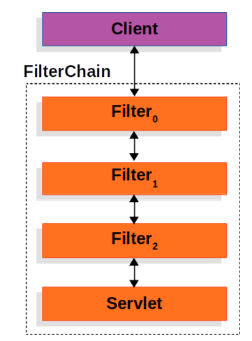
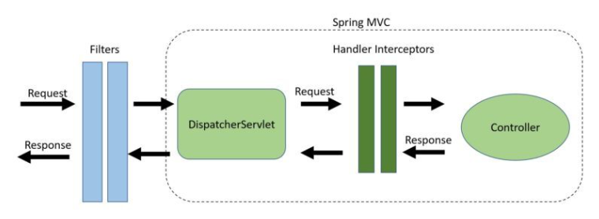

필터와 인터셉터 모두 웹 애플리케이션에서 요청을 가로채어 중간에서 작업을 처리하는 구성요소이다. 

## 공통점

1. 필터 체인, 인터셉터 스택을 통해서 요청과 응답에 대한 여러 작업을 순차적으로 처리할 수 있다.
2. 두 기능 모두 웹 애플리케이션의 핵심 로직과 분리되어 작업을 수행하고, 작업을 공통적으로 처리하여 코드의 중복을 줄일 수 있는 장점이 있다.

이 둘은 어떻게 동작하며, 차이점은 무엇이 있을까? 각 기능에 대해서 알아보자!

# Filter

필터는 J2EE 표준 스펙 기능으로 DispatcherServlet에 요청이 전달되기 전/후에 부가 작업을 처리할 수 있는 기능을 제공한다.

스프링이 아닌 톰캣과 같은 웹 컨테이너에 의해 관리가 되지만, 스프링 빈으로 등록은 가능하다.
<details>
<summary>필터는 여러개를 체인 형식으로 묶어서 처리할 수도 있다. </summary>
<div markdown="1">



</div>
</details>
    

## 메소드

Filter 인터페이스는 3가지 메소드를 가지고 있다.

```java
public interface Filter {

    public default void init(FilterConfig filterConfig) throws ServletException {}

    public void doFilter(ServletRequest request, ServletResponse response, FilterChain chain) throws IOException, ServletException;

    public default void destroy() {}
}
```

1. init 메소드
    - 필터 객체를 초기화하고 서비스에 추가하기 위한 메소드
    - 웹 컨테이너가 init 메소드를 호출하여 필터 객체를 초기화 하면 이후 요청들은 doFilter를 통해서 처리된다.
2. doFilter 메소드
    - 이 메소드에서 실제 필터링 작업을 수행하며, 요청/응답 데이터를 수정할 수 있다.
    - FilterChain 객체를 사용하여 다음 필터로 제어를 전달하고, 모든 작업이 다 끝나면 요청을 처리할 컨트롤러로 전달한다.
3. destroy 메소드
    - 필터가 소멸될 때 호출되는 메소드
    - 필터 자원을 정리하고 메모리 누수를 방지하기 위해서 사용한다.

# InterCeptor

인터셉터는 스프링이 제공하는 기술이기 때문에 스프링 컨텍스트에서 동작한다. 

## 메소드

HandlerInterceptor 인터페이스는 3가지 메소드를 가지고 있다.

```java
public interface HandlerInterceptor {

    default boolean preHandle(HttpServletRequest request, HttpServletResponse response, Object handler)
        throws Exception {
        
        return true;
    }

    default void postHandle(HttpServletRequest request, HttpServletResponse response, Object handler,
        @Nullable ModelAndView modelAndView) throws Exception {
    }

    default void afterCompletion(HttpServletRequest request, HttpServletResponse response, Object handler,
        @Nullable Exception ex) throws Exception {
    }
}
```

1. preHandler 메소드
    - 컨트롤러의 메소드가 실행되기 전에 호출 된다.
    - 요청을 가로채서 수정할 수 있는 메소드, false를 반환하면 요청을 계속 처리하지 않고 중단된다.
2. postHandler 메소드
    - 컨트롤러의 메소드가 실행된 후 뷰가 렌더링 되기 전에 호출되는 메소드
    - 컨트롤러 이후에 처리해야하는 후처리 작업에 주로 사용된다.
3. afterCompletion 메소드
    - 뷰가 렌더링 된 후에 호출된다.
    - 예외 처리 및 마무리 작업을 할 수 있다.

## 차이점



[이미지 출처](https://www.baeldung.com/spring-mvc-handlerinterceptor-vs-filter)

필터는 DispatcherServlet에 도달하기 전 요청을 가로채며 인증, 로깅 및 감사, 이미지 및 데이터 압축, Spring MVC에서 분리하고 싶은 모든 기능에 적합하다.

인터셉터는 DispatcherServlet과 Controller 사이의 요청을 가로채며 세부적인 보안 및 인증/인가에 관련된 공통 작업과 Controller로 넘겨주는 데이터를 가공하는데 적합하다.

