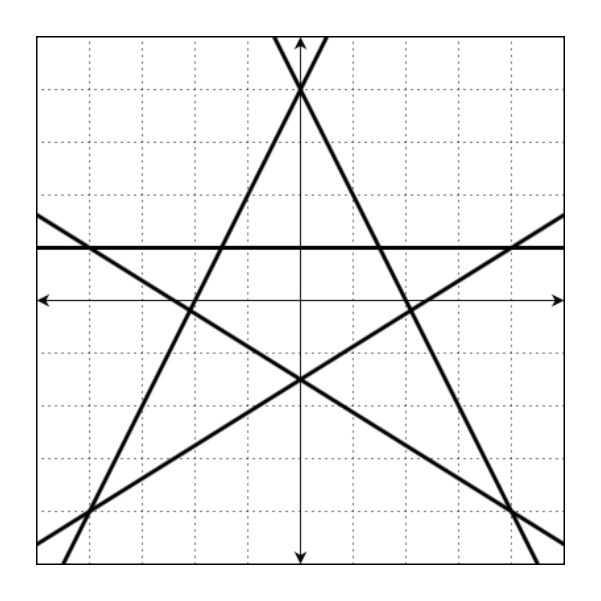
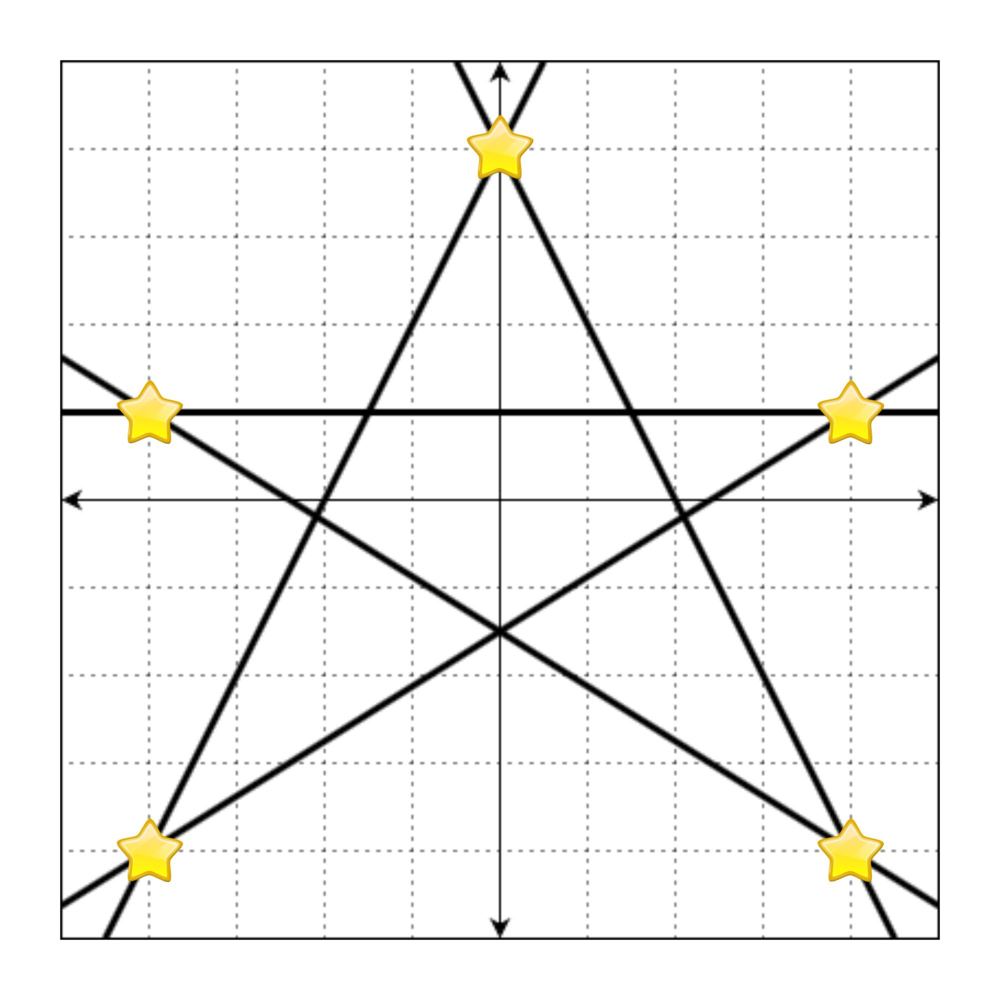
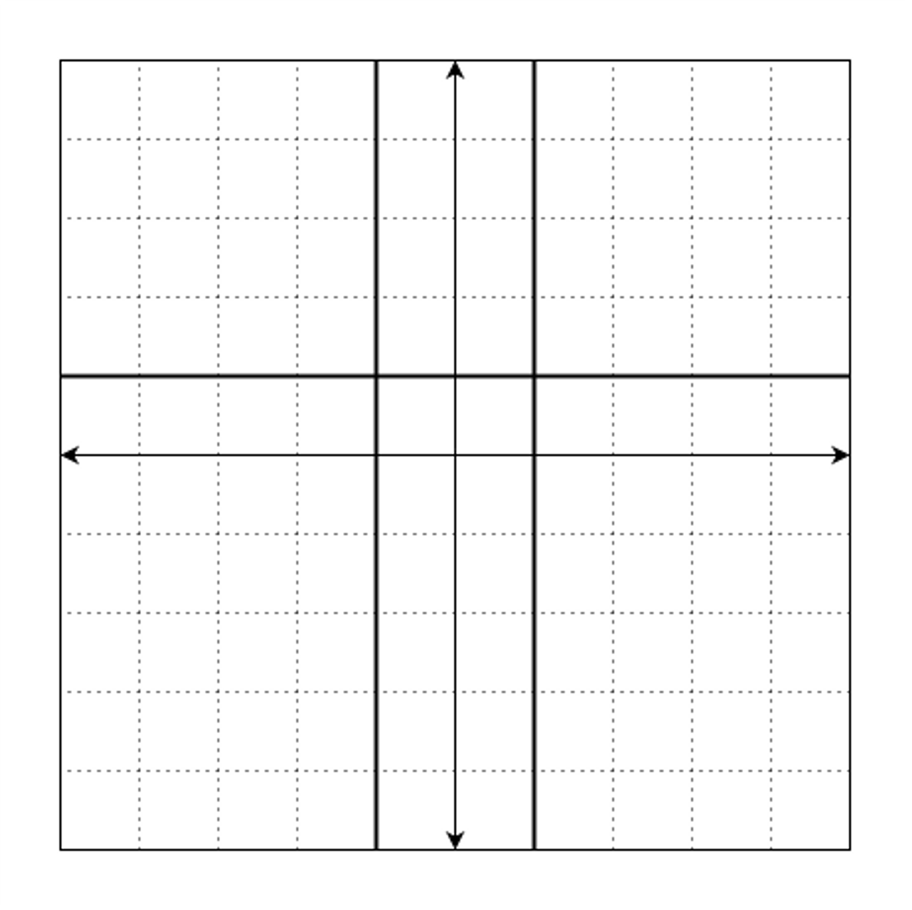
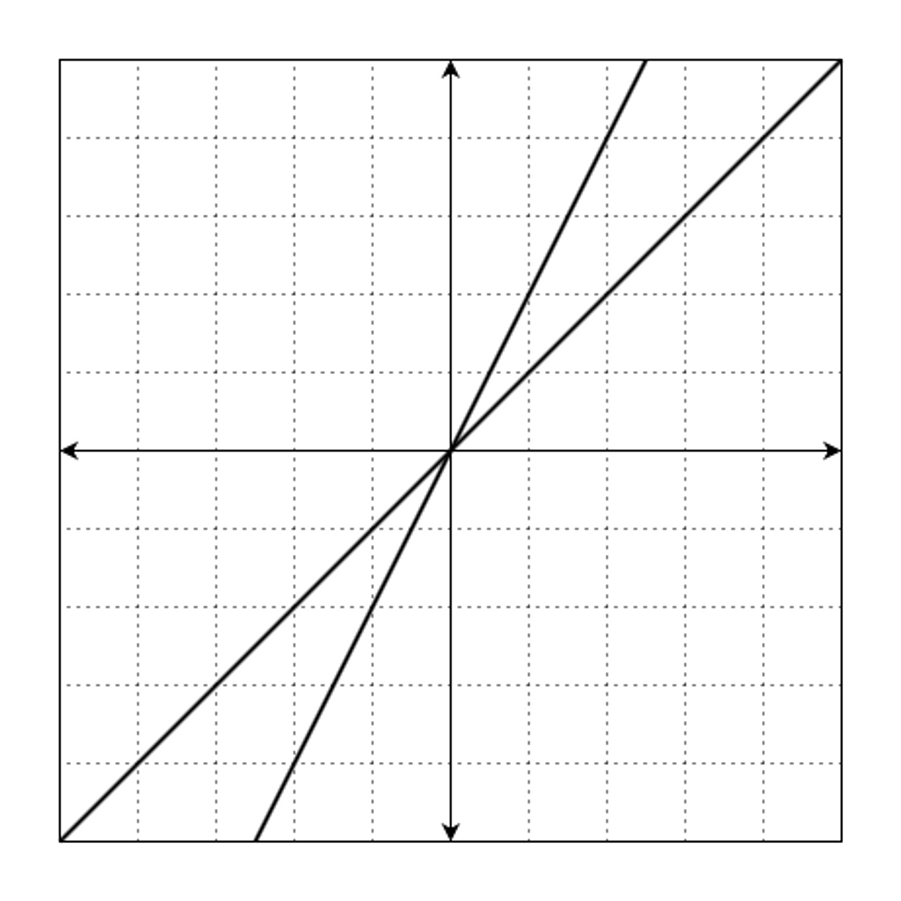
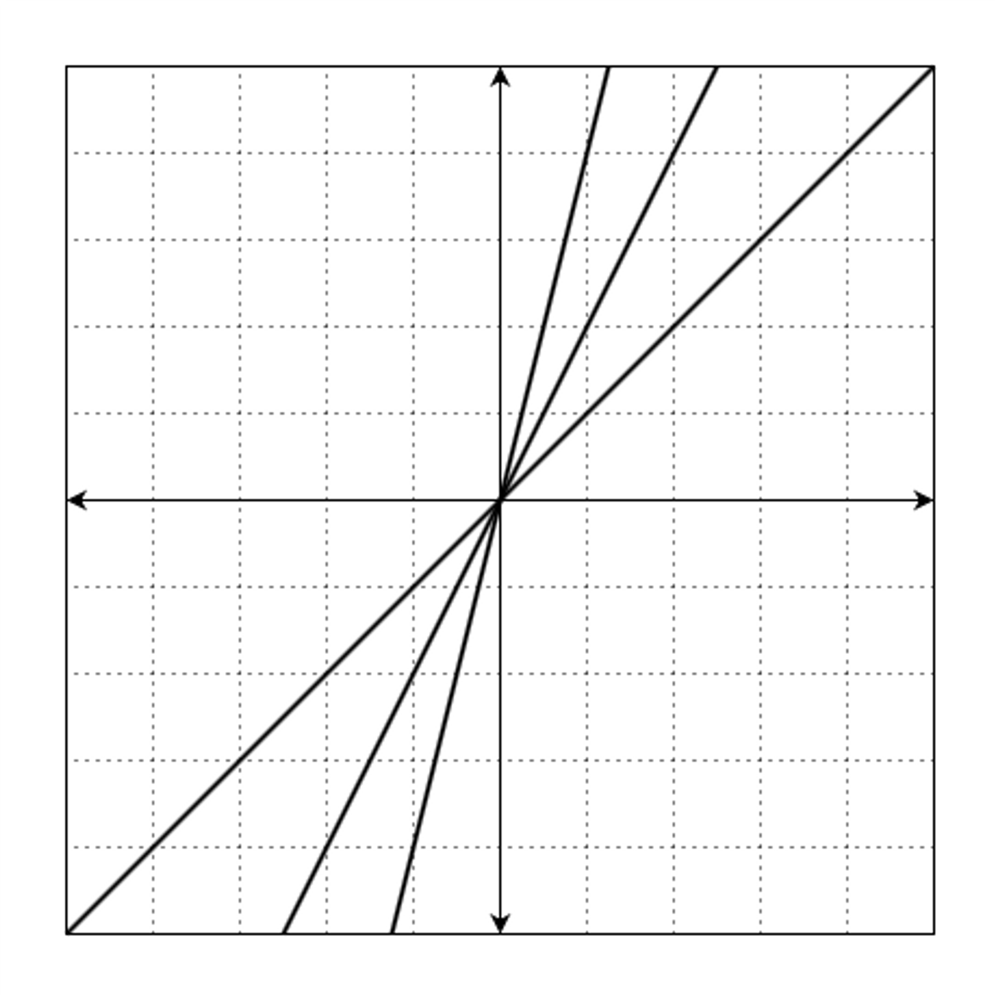
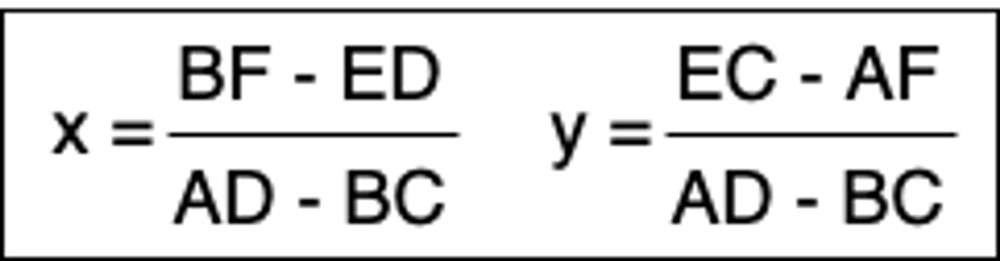

# 교점에 별 만들기

### **문제 설명**

`Ax + By + C = 0`으로 표현할 수 있는 `n`개의 직선이 주어질 때, 이 직선의 교점 중 정수 좌표에 별을 그리려 합니다.

예를 들어, 다음과 같은 직선 5개를

- `2x - y + 4 = 0`
- `2x - y + 4 = 0`
- `y + 1 = 0`
- `5x - 8y - 12 = 0`
- `5x + 8y + 12 = 0`

좌표 평면 위에 그리면 아래 그림과 같습니다.



이때, 모든 교점의 좌표는 `(4, 1)`, `(4, -4)`, `(-4, -4)`, `(-4, 1)`, `(0, 4)`, `(1.5, 1.0)`, `(2.1, -0.19)`, `(0, -1.5)`, `(-2.1, -0.19)`, `(-1.5, 1.0)`입니다. 이 중 정수로만 표현되는 좌표는 `(4, 1)`, `(4, -4)`, `(-4, -4)`, `(-4, 1)`, `(0, 4)`입니다.

만약 정수로 표현되는 교점에 별을 그리면 다음과 같습니다.



위의 그림을 문자열로 나타낼 때, 별이 그려진 부분은 `*`, 빈 공간(격자선이 교차하는 지점)은 `.`으로 표현하면 다음과 같습니다.

`"..........." ".....*....." "..........." "..........." ".*.......*." "..........." "..........." "..........." "..........." ".*.......*." "..........."`

이때 격자판은 무한히 넓으니 모든 별을 포함하는 최소한의 크기만 나타내면 됩니다.

따라서 정답은

`"....*...." "........." "........." "*.......*" "........." "........." "........." "........." "*.......*"`

입니다.

직선 `A, B, C`에 대한 정보가 담긴 배열 `line`이 매개변수로 주어집니다. 이때 모든 별을 포함하는 최소 사각형을 return 하도록 solution 함수를 완성해주세요.

---

### 제한사항

- line의 세로(행) 길이는 2 이상 1,000 이하인 자연수입니다.
  - line의 가로(열) 길이는 3입니다.
  - line의 각 원소는 [A, B, C] 형태입니다.
  - A, B, C는 -100,000 이상 100,000 이하인 정수입니다.
  - 무수히 많은 교점이 생기는 직선 쌍은 주어지지 않습니다.
  - A = 0이면서 B = 0인 경우는 주어지지 않습니다.
- 정답은 1,000 \* 1,000 크기 이내에서 표현됩니다.
- 별이 한 개 이상 그려지는 입력만 주어집니다.

---

### 입출력 예

| line                                                            | result                                                                                                                |
| --------------------------------------------------------------- | --------------------------------------------------------------------------------------------------------------------- |
| [[2, -1, 4], [-2, -1, 4], [0, -1, 1], [5, -8, -12], [5, 8, 12]] | ["....*....", ".........", ".........", "*.......*", ".........", ".........", ".........", ".........", "*.......*"] |
| [[0, 1, -1], [1, 0, -1], [1, 0, 1]]                             | ["*.*"]                                                                                                               |
| [[1, -1, 0], [2, -1, 0]]                                        | ["*"]                                                                                                                 |
| [[1, -1, 0], [2, -1, 0], [4, -1, 0]]                            | ["*"]                                                                                                                 |

---

### 입출력 예 설명

**입출력 예 #1**

문제 예시와 같습니다.

**입출력 예 #2**

직선 `y = 1`, `x = 1`, `x = -1`는 다음과 같습니다.



`(-1, 1)`, `(1, 1)` 에서 교점이 발생합니다.

따라서 정답은

`"*.*"`

입니다.

**입출력 예 #3**

직선 `y = x`, `y = 2x`는 다음과 같습니다.



`(0, 0)` 에서 교점이 발생합니다.

따라서 정답은

`"*"`

입니다.

**입출력 예 #4**

직선 `y = x`, `y = 2x`, `y = 4x`는 다음과 같습니다.



`(0, 0)` 에서 교점이 발생합니다.

따라서 정답은

`"*"`

입니다.

---

### 참고 사항

`Ax + By + E = 0`

`Cx + Dy + F = 0`

두 직선의 교점이 유일하게 존재할 경우, 그 교점은 다음과 같습니다.



또, AD - BC = 0인 경우 두 직선은 평행 또는 일치합니다.

### 문제풀이 흐름

1. 모든 직선 쌍에 대해서 반복을 진행한다.
   1-1. 교점 좌표를 구해서 정수 좌표만 저장하기
2. 1의 결과에 대해 x, y 좌표의 최댓값, 최솟값 구하기
3. 2의 결과로 2차원 배열의 크기를 결정하고 배열에 별 표시
4. 문자열 배열로 반환

### 풀이

```java
import java.util.*;

class Solution {

    public String[] solution(int[][] line) {

				//교점 중 정수인 좌표를 담는 리스트
        List<Point> points = new ArrayList<Point>();

				//모든 직선쌍에 대해서 반복
        for(int i = 0; i < line.length; i++){
            for(int j = i+1; j < line.length; j++){
                Point intersection = intersection(line[i][0], line[i][1], line[i][2], line[j][0], line[j][1], line[j][2]);

                if(intersection != null){
                    points.add(intersection);
                }
            }
        }

        Point minPoints = getMinValue(points); //좌표 최솟값
        Point maxPoints = getMaxValue(points); //좌표 최댓값

        int w = (int) (maxPoints.x - minPoints.x + 1);
        int h = (int) (maxPoints.y - minPoints.y + 1);

        char[][] arr = new char[h][w];
        for(char[] row : arr){
            Arrays.fill(row, '.');
        }

        for(Point p : points){
            int x = (int) (p.x - minPoints.x);
            int y = (int) (maxPoints.y - p.y);
            arr[y][x] = '*';
        }

        String[] answer = new String[arr.length];
        for(int i = 0; i < answer.length; i++){
            answer[i] = new String(arr[i]);
        }

        return answer;
    }

    public Point getMinValue(List<Point> points){
        long x = Long.MAX_VALUE;
        long y = Long.MAX_VALUE;

        for(Point p : points){
            if(p.x < x){
                x = p.x;
            }

            if(p.y < y){
                y = p.y;
            }
        }

        return new Point(x, y);
    }

    public Point getMaxValue(List<Point> points){
        long x = Long.MIN_VALUE;
        long y = Long.MIN_VALUE;

        for(Point p : points){
            if(p.x > x){
                x = p.x;
            }

            if(p.y > y){
                y = p.y;
            }
        }

        return new Point(x, y);
    }


		//교점 중 정수를 골라서 담는 메소드
    public Point intersection(long a1, long b1, long c1, long a2, long b2, long c2){
        double x = (double) (b1 * c2 - c1 * b2) / (a1 * b2 - b1 * a2);
        double y = (double) (c1 * a2 - a1 * c2) / (a1 * b2 - b1 * a2);

        if(x % 1 != 0 || y % 1 != 0){
            return null;
        }

        return new Point((long) x, (long) y);
    }

		//좌표를 나타내는 클래스
    private static class Point{
        public final long x, y;

        private Point(long x, long y){
            this.x = x;
            this.y = y;
        }
    }
}
```

- 문제 조건 중 1000\*1000 크기 이내에 표현된다는 조건은 찍히는 별의 사이의 거리가 멀지 않다는 조건일 뿐, 실제 좌표 값이 작다는 의미가 아니기 때문에 long으로 선언해줘야한다.

```toc

```
