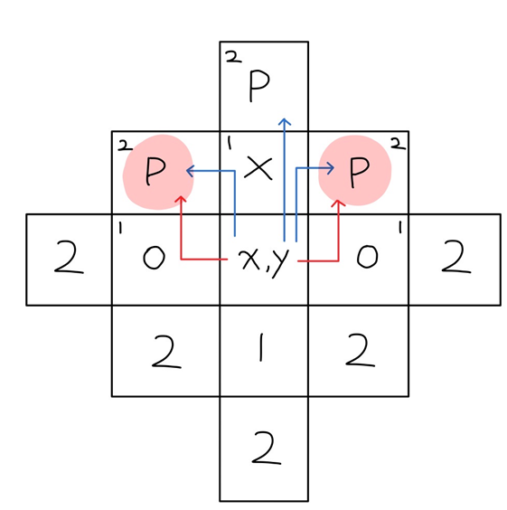

[문제](https://school.programmers.co.kr/learn/courses/30/lessons/81302)

### 문제풀이 흐름

1. 대기실의 모든 응시자 위치에 대해 반복 <br>
   1-1. 좌표의 상하좌우 중 빈 테이블이 있는 방향 찾기<br>
   1-2. 빈 테이블과 인접한 위치 중 응시자가 있는지 찾기 <- 거리두기를 지키지 않은 것<br>
2. 1의 경우를 찾지 못하면 거리두기를 지킨 것

### 풀이

> dx, dy로 방향을 정하는 방법 <br>
> dx, dy는 각각 x의 변화량, y의 변화량을 뜻한다. <br>
> 변화량이란 특정 방향으로 이동할 때 해당 좌표 값이 어떻게 변화하는지를 의미한다. <br>
> dx, dy는 상하좌우 네 방향에 따라서 아래와 같은 값을 가진다. <br>
> ||상|하|좌|우|
> |-||-||-||-||-|
> |dx|0|0|-1|1|
> |dy|-1|1|0|0|

#### 맨해튼 거리



- 맨해튼 거리2에 도달하려면 맨해튼 거리1(상하좌우)을 거쳐야함
- 맨해튼 거리1이 파티션으로 막혀있다면, 맨해튼 거리2에 응시자가 있어도 거리두기 조건을 만족함
- 위쪽 방향의 좌표가 파티션으로 막혀있다면 위쪽 방향의 맨해튼 거리2는 더이상 추가적인 검사를 하지 않아도 되는것 처럼 보임(파란색 화살표 방향으로 접근 시 거리두기 조건 만족)
- 하지만 빨간색 음영으로 표시된 좌표는 오른쪽이나 왼쪽 방향을 통해서도 접근이 가능함(빨간색 화살표 방향으로 접근 시 거리두기 조건 불만족)
- 따라서, 막혀있는 방향이 아닌 뚫려있는 방향을 추가적으로 검사해야 함

#### 주어진 데이터 가공하기

```java
for(int i = 0; i < places.length; i++){
    String[] place = places[i];
    char[][] room = new char[place.length][];

    for(int j = 0; j < room.length; j++){
        room[j] = place[j].toCharArray();
    }
}
```

- 주어진 입력 데이터는 String[][] 형태로 들어오며, 대기실 하나는 String[] 형식
  - `["POOOP", "OXXOX", "OPXPX", "OOXOX", "POXXP"]`
- 각 대기실 별로 거리두기 조건을 검사해야하므로 char[][]형태로 변환
  - `[['P','O','O','O','P'],`<br>
    `['O','X','X','O','X'],`<br>
    `['O','P','X','P','X'],`<br>
    `['O','O','X','O','X'],`<br>
    `['P','O','X','X','P']]`

#### 거리두기 조건 검사할 메소드 작성하기

```java
private boolean isDistance(char[][] room){

    for(int y = 0; y < room.length; y++){
        for(int x = 0; x < room[y].length; x++){
            if(room[y][x] != 'P') continue;
            //거리두기 검사 진행
        }
    }
    return true;
}
```

- 응시자가 앉은 좌표의 주변을 검사해야하기 때문에 응시자가 안 앉아있는 좌표는 건너뛴다.

#### 상하좌우중 빈 테이블이 있는 방향 찾아서 진행

```java
    private static final int[] dx = {0, 0, -1, 1};
    private static final int[] dy = {-1, 1, 0, 0};

    for(int d = 0; d < 4; d++){
        int nx = x + dx[d];
        int ny = y + dy[d];

        //상하좌우로 움직인 좌표가 범위를 벗어나는지 체크
        if(ny < 0 || ny > room.length || nx < 0 || nx > room[ny].length) continue;

        switch(room[ny][nx]){
            case 'P': return false; //거리두기 조건 불만족
            case 'O': //추가검사 필요
        }
    }
```

- `room[ny][nx]`의 세가지 값
  - X(파티션) : 주변에 다른 응시자가 있어도 거리두기 조건을 만족하기 때문에 추가 검사 필요하지 않음
  - P(응시자) : 맨해튼 거리1에 다른 응시자가 있는 경우이므로 거리두기 조건을 불만족함
  - O(빈 자리) : 인접한 곳에 다른 응시자가 있다면 거리두기 조건을 불만족 하기 때문에 추가 검사 필요함

#### 빈 테이블과 인접한 위치중 다른 응시자가 있는지 확인하기

```java
private boolean isNext(char[][] room, int x, int y, int exclude){
    for(int d = 0; d < 4; d++){
        if(d == exclude) continue;

        int nx = x + dx[d];
        int ny = y + dy[d];

        //상하좌우로 움직인 좌표가 범위를 벗어나는지 체크
        if(ny < 0 || ny > room.length || nx < 0 || nx > room[ny].length) continue;
        //해당 좌표에 응시자가 있다면 조건 불만족
        if(room[ny][nx] == 'P') return true;
    }
    //응시자가 없다면 조건 만족
    return false;
}
```

- 맨해튼 거리1에서 인접한 곳이라면 다시 상하좌우를 의미함
- 맨해튼 거리1에서 상하좌우 재검사를 진행하는데, 원래 검사를 시작했던 좌표는 제외해야 함
- 따라서 재검사메소드에 제외할 방향도 함께 전달해주어야 함

### 최종코드

```java
class Solution {
    private static final int[] dx = {0, -1, 1, 0};
    private static final int[] dy = {-1, 0, 0, 1};

    public int[] solution(String[][] places){
        int[] answer = new int[places.length];
        for(int i = 0; i < places.length; i++){
            String[] place = places[i];
            char[][] room = new char[place.length][];

            for(int j = 0; j < room.length; j++){
                room[j] = place[j].toCharArray();
            }

            if(isDistance(room)){
                answer[i] = 1;
            }else{
                answer[i] = 0;
            }
        }

        return answer;
    }

    //거리두기 조건 검사
    private boolean isDistance(char[][] room){
        for(int y = 0; y < room.length; y++){
            for(int x = 0; x < room[y].length; x++){
                if(room[y][x] != 'P') continue; //응시자가 앉지 않은 좌표는 건너 뜀

                //응시자가 앉아 있는 좌표 상하좌우 검사
                for(int d = 0; d < 4; d++){
                    int nx = x + dx[d];
                    int ny = y + dy[d];

                    //상하좌우로 옮겨진 좌표가 범위를 벗어난다면 건너 뜀
                    if(ny < 0 || ny > room.length || nx < 0 || nx > room[ny].length) continue;
                    switch(room[ny][nx]){
                        case 'P': return false; //상하좌우로 옮겨진 좌표에 응시자가 있다면 조건 불만족
                        case 'O': //상하좌우로 옮겨진 좌표에 빈 자리가 있다면 추가 검사 필요
                            if(isNext(room, nx, ny, 3-d)) return false;
                            break;
                    }
                }
                return true;
            }
        }
        return true;
    }

    private boolean isNext(char[][] room, int x, int y, int exclude){
        for(int d = 0; d < 4; d++){

            //현재 방향이 이전에 검사했던 좌표와 같다면 건너 뜀
            if(d == exclude) continue;

            int nx = x + dx[d];
            int ny = y + dy[d];

            //상하좌우로 옮겨진 좌표가 범위를 벗어난다면 건너 뜀
            if(ny < 0 || ny > room.length || nx < 0 || nx > room[ny].length) continue;
            if(room[ny][nx] == 'P') return true; //빈 자리 인접한 곳에 응시자가 있다면 조건 불만족
        }

        return false;
    }
}
```

```toc

```
