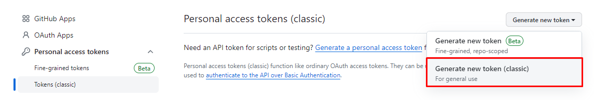
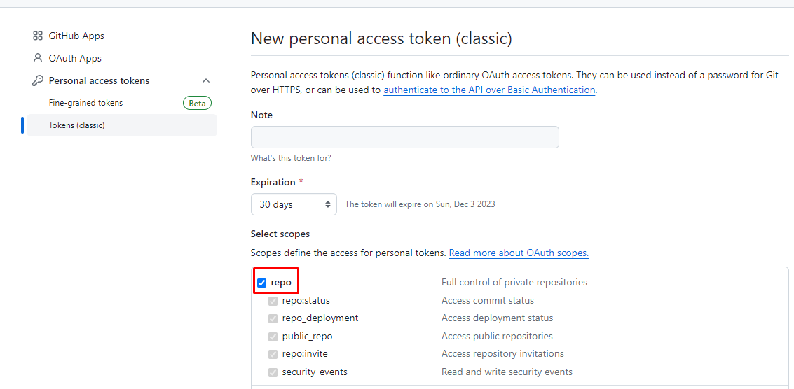
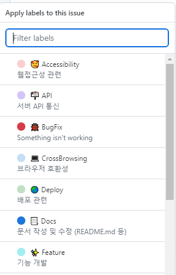

스프링 개인 프로젝트를 진행하기 전 이슈로 할 일을 관리하려고 한다. 이슈에 라벨을 등록하려고 하는데 내가 원하는 내용이 없었다. 다른 사람들은 어떻게 관리하나 블로그 구경을 다녔는데, 다들 커스텀해서 관리하고 있었던게 아니였나..! 간단하게 할 수 있길래 따라해봤다. [이 글](https://velog.io/@rimo09/Github-github-label-%ED%95%9C%EB%B2%88%EC%97%90-%EC%A0%81%EC%9A%A9%ED%95%98%EA%B8%B0)을 참고하면서 진행했다.

## 1. label.json 파일 생성하기
```json
[
    {
    "name": "⚙ Setting",
    "color": "e3dede",
    "description": "개발 환경 세팅"
    },
    {
    "name": "✨ Feature",
    "color": "a2eeef",
    "description": "기능 개발"
    },
    {
    "name": "🌏 Deploy",
    "color": "C2E0C6",
    "description": "배포 관련"
    },
    {
    "name": "🎨 Html&css",
    "color": "FEF2C0",
    "description": "마크업 & 스타일링"
    },
    {
    "name": "🐞 BugFix",
    "color": "d73a4a",
    "description": "Something isn't working"
    },
    {
    "name": "💻 CrossBrowsing",
    "color": "C5DEF5",
    "description": "브라우저 호환성"
    },
    {
    "name": "📃 Docs",
    "color": "1D76DB",
    "description": "문서 작성 및 수정 (README.md 등)"
    },
    {
    "name": "📬 API",
    "color": "D4C5F9",
    "description": "서버 API 통신"
    },
    {
    "name": "🔨 Refactor",
    "color": "f29a4e",
    "description": "코드 리팩토링"
    },
    {
    "name": "🙋‍♂️ Question",
    "color": "9ED447",
    "description": "Further information is requested"
    },
    {
    "name": "🥰 Accessibility",
    "color": "facfcf",
    "description": "웹접근성 관련"
    },
    {
    "name": "✅ Test",
    "color": "ccffc4",
    "description": "test 관련(storybook, jest...)"
    }
]
```
## 2. 토큰 발행하기
나는 발급해둔 토큰이 없었기때문에 이번에 발행했다.



## 3. github-label-sync 설치
GitHub Label Sync을 설치해준다.
```
npm install -g github-label-sync
```
## 4. LABEL 적용
label.json 파일이 있는 위치에서 아래 명령어를 실행하면 완료!
```
github-label-sync --access-token [액세스 토큰] --labels label.json [계정명]/[저장소 이름]
```

아래 사진과 같이 적용 된 것을 확인할 수 있다.

